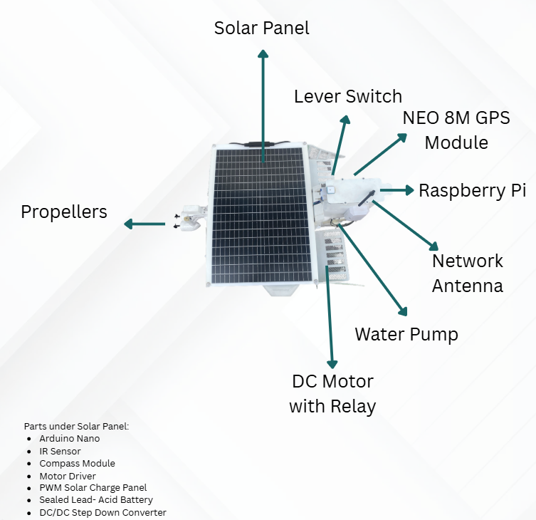
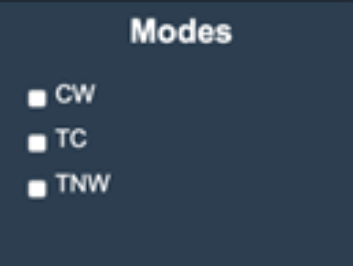
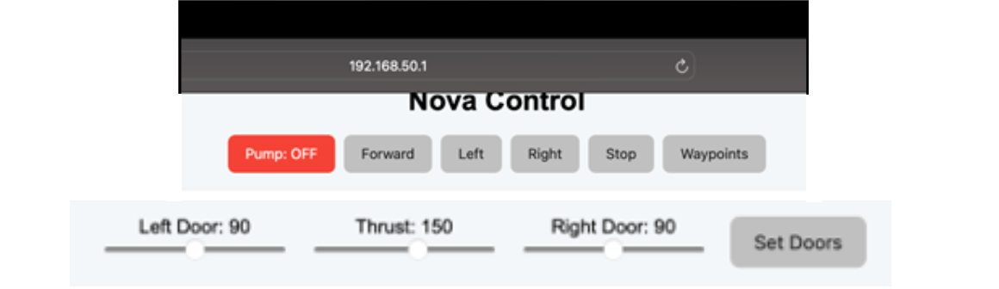
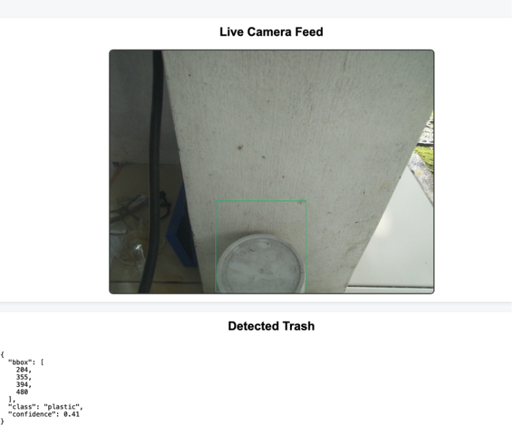
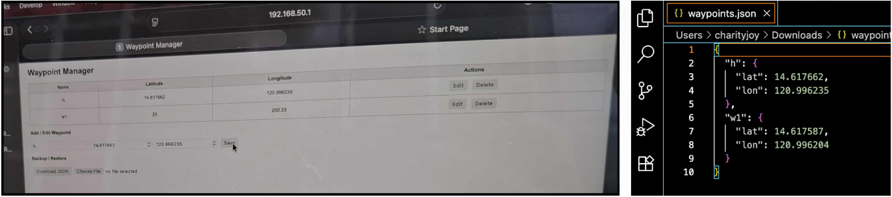

# 🌊 AquaNova: Autonomous Solar-Powered Floating Robot
**User Manual & System Documentation**

AquaNova is an autonomous IoT-integrated robotic system designed for aquatic waste management and environmental monitoring. This manual covers hardware integration, operational modes, and software control interfaces.

---

## 🛠️ 1. Hardware Architecture
The system integrates low-level microcontroller logic with high-level processing for navigation and computer vision.

### System Components

| ID | Component | Primary Function |
| :--- | :--- | :--- |
| **A** | **Arduino Nano** | Main microcontroller for real-time hardware logic. |
| **B** | **Raspberry Pi** | Handles AI Trash Detection and Wi-Fi streaming. |
| **C** | **NEO-6M GPS** | Provides geospatial coordinates for waypoint navigation. |
| **D** | **HMC5883L Compass** | Magnetometer for precise heading and orientation. |
| **E** | **Servo/Motor Driver** | Controls propulsion and steering actuators. |
| **F** | **FC-51 IR Sensors** | Proximity detection for obstacle avoidance. |
| **H** | **Propellers** | Dual-motor propulsion for water maneuverability. |
| **I** | **DC Motor + Relay** | Powering the waste collection/scooping mechanism. |
| **K** | **Solar Panel** | Renewable energy harvesting for 24/7 operation. |
| **L** | **Battery Array** | High-capacity energy storage for evening deployment. |
| **N** | **Water Pump** | Active cooling system for internal electronics. |

### Integration Diagram

*Detailed schematic showing the power distribution from the solar array to the logic controllers.*

---

## 🤖 2. Operational Modes
AquaNova features three distinct operational states to ensure flexibility in different aquatic environments.

1.  **CW (Continuous Work):** Standard operation focusing on thorough area coverage.
2.  **TC (Target Collection):** Specialized mode for high-density waste areas.
3.  **TNW (Timed Navigation Waypoints):** Pre-programmed route following via GPS.

---

## 🖥️ 3. Software Control Interface
The robot is managed via a custom web-based dashboard that provides real-time telemetry and manual override capabilities.

### Manual Control & Status

*Users can take direct control of propulsion and the collection mechanism.*

* **Mode Status:** Real-time feedback on the robot's current AI state and battery health. (`Mode Status.png`)
* **Sensor Feedback:** Live telemetry data from the GPS, Compass, and IR sensors. (`sensor-reading.png`)

### AI Trash Detection

*The system utilizes a trained model to identify and track floating debris.*

---

## 📍 4. Navigation & Pathfinding
Using the **Waypoints Manager**, users can map out specific zones for the robot to patrol.

* **Coordinate Input:** Set precise Latitude/Longitude targets.
* **Autonomous Pathing:** The robot automatically calculates the most efficient route between points while avoiding obstacles via IR sensors.

---

## 📂 5. External Resources
For a complete technical breakdown including circuit schematics and battery maintenance, refer to the full document:

* 📄 [Download Full AquaNova Technical Manual (PDF)](AquaNova-User-Manual.pdf)

---
**Lead Developer:** John Ivan Ello | 2025
